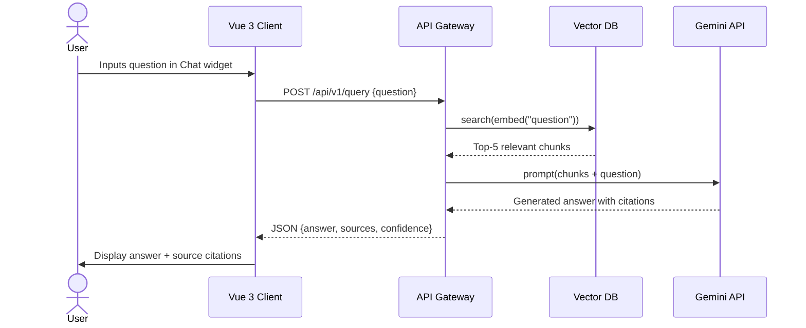
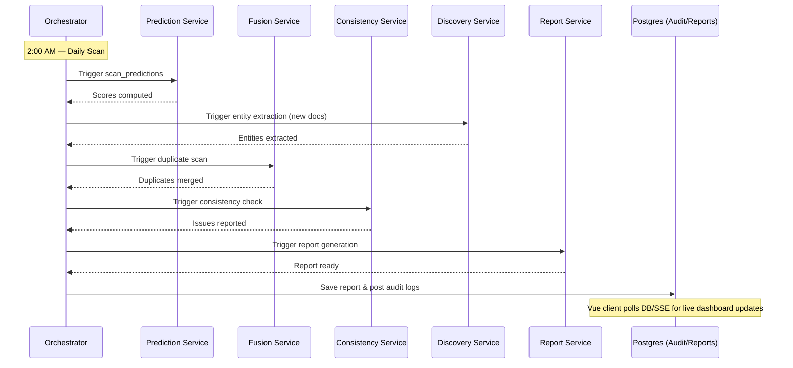

# 4. Week 4 — Interoperability, Cloud Deployment & Final Evaluation

> **Goal**: Address the **interoperability gap** identified in the thesis proposal, deploy the system to the Cloud, and conduct rigorous evaluation for the Master's thesis defense.

---

## Day 1 (Mon): Enterprise Interoperability Layer

### 4.1.1 The Interoperability Problem

From the thesis proposal (Mme CHIKHI Imane):

> "Cette validation a permis de mettre en évidence les aspects non abordés dans le modèle. Il s'agit des aspects de la dimension Technologique, plus particulièrement du facteur Interopérabilité et intégration. Le modèle proposé doit donc être enrichi en intégrant des activités visant l'instauration de mécanismes permettant d'intégrer explicitement les outils de gestion de connaissances avec les systèmes organisationnels, et d'en assurer l'interopérabilité."

This is one of the **two main objectives** of the thesis. Our system must be able to connect with external enterprise systems (HR, ERP, CRM, etc.).

### 4.1.2 Interoperability Architecture

```
External Enterprise Systems (HR, ERP, CRM, Intranet)
    │
    ▼
┌──────────────────────────────────┐
│  API Gateway (FastAPI)            │
│  ┌────────────────────────────┐  │
│  │ /api/v1/documents          │  │  ← CRUD on knowledge documents
│  │ /api/v1/query              │  │  ← RAG semantic search
│  │ /api/v1/reports            │  │  ← Retrieve generated reports
│  │ /api/v1/status             │  │  ← System health metrics
│  │ /api/v1/webhooks/register  │  │  ← Register webhook endpoints
│  │ /api/v1/concepts           │  │  ← Query the Knowledge Graph
│  └────────────────────────────┘  │
│  Authentication: JWT / API Keys  │
└──────────────────────────────────┘
    │
    ▼
┌──────────────────────────────────┐
│  Webhooks (Outbound)              │
│  POST → External System URL      │
│  Events:                          │
│    - document.updated             │
│    - alert.obsolescence           │
│    - report.generated             │
│    - consistency.issue_found      │
└──────────────────────────────────┘
```

### 4.1.3 RESTful API Endpoints

```python
# backend/services/api-gateway/app/routes/external_api.py
from fastapi import APIRouter, Depends, HTTPException
from fastapi.security import HTTPBearer, HTTPAuthorizationCredentials

router = APIRouter(prefix="/api/v1")
security = HTTPBearer()

@router.get("/documents")
async def list_documents(
    department: str = None,
    status: str = "active",
    credentials: HTTPAuthorizationCredentials = Depends(security)
):
    """
    List all knowledge documents, optionally filtered by department.
    Used by: HR portal to show relevant knowledge to employees.
    """
    verify_token(credentials)
    return await get_documents(department=department, status=status)

@router.post("/documents")
async def push_document(
    doc: DocumentCreate,
    credentials: HTTPAuthorizationCredentials = Depends(security)
):
    """
    External systems push new documents directly to the KM system.
    Used by: ERP exporting updated procedures, HR uploading policy changes.
    """
    verify_token(credentials)
    result = await ingest_document_from_api(doc)
    return {"id": result.id, "status": "ingested"}

@router.post("/query")
async def semantic_query(
    query: QueryRequest,
    credentials: HTTPAuthorizationCredentials = Depends(security)
):
    """
    Semantic search endpoint for external applications.
    Used by: Intranet search bar, mobile app, CRM knowledge panel.
    """
    verify_token(credentials)
    result = rag_pipeline.answer(query.question, top_k=query.top_k or 5)
    return result

@router.get("/concepts")
async def query_concepts(
    name: str = None,
    related_to: str = None,
    credentials: HTTPAuthorizationCredentials = Depends(security)
):
    """
    Query the Knowledge Graph for concept relationships.
    Used by: Analytics dashboards, R&D team knowledge mapping tools.
    """
    verify_token(credentials)
    if related_to:
        return await get_related_concepts(related_to)
    return await search_concepts(name)

@router.post("/webhooks/register")
async def register_webhook(
    webhook: WebhookRegistration,
    credentials: HTTPAuthorizationCredentials = Depends(security)
):
    """
    External systems register to receive push notifications.
    Events: document.updated, alert.obsolescence, report.generated
    """
    verify_token(credentials)
    save_webhook(webhook)
    return {"status": "registered", "events": webhook.events}
```

### 4.1.4 JWT Authentication

```python
# backend/services/api-gateway/app/auth.py
from jose import jwt, JWTError

SECRET_KEY = os.environ["JWT_SECRET_KEY"]
ALGORITHM = "HS256"

def create_api_token(client_name: str, scopes: list[str]) -> str:
    payload = {
        "sub": client_name,
        "scopes": scopes,
        "exp": datetime.utcnow() + timedelta(days=365)
    }
    return jwt.encode(payload, SECRET_KEY, algorithm=ALGORITHM)

def verify_token(credentials: HTTPAuthorizationCredentials):
    try:
        payload = jwt.decode(credentials.credentials, SECRET_KEY, algorithms=[ALGORITHM])
        return payload
    except JWTError:
        raise HTTPException(status_code=401, detail="Invalid or expired token")
```

### 4.1.5 Webhook Dispatcher

```python
# backend/shared/webhooks/dispatcher.py
import httpx

class WebhookDispatcher:
    def __init__(self):
        self.registered_webhooks = load_webhooks_from_db()

    async def dispatch(self, event_type: str, payload: dict):
        """
        When an internal event occurs, notify all registered external systems.
        """
        for webhook in self.registered_webhooks:
            if event_type in webhook['events']:
                async with httpx.AsyncClient() as client:
                    try:
                        await client.post(
                            webhook['url'],
                            json={"event": event_type, "data": payload},
                            headers={"X-KM-Signature": sign_payload(payload, webhook['secret'])},
                            timeout=10.0
                        )
                    except httpx.RequestError:
                        log_webhook_failure(webhook['id'], event_type)
```

### 4.1.6 OpenAPI Documentation

FastAPI auto-generates Swagger UI at `/docs` and ReDoc at `/redoc`. This serves as the **official API documentation** for integration teams.

**Deliverable**: A secure, documented REST API that external systems can integrate with, plus outbound webhooks.

---

## Day 2 (Tue): Cloud Deployment Preparation

### 4.2.1 Production Dockerfiles

```dockerfile
# Optimized multi-stage build for production
FROM python:3.10-slim AS builder
WORKDIR /build
COPY requirements.txt .
RUN pip install --no-cache-dir --prefix=/install -r requirements.txt

FROM python:3.10-slim
WORKDIR /app
COPY --from=builder /install /usr/local
COPY shared/ /app/shared/
COPY app/ /app/app/

# Security: non-root user
RUN adduser --disabled-password --gecos '' appuser
USER appuser

EXPOSE 8000
CMD ["uvicorn", "app.main:app", "--host", "0.0.0.0", "--port", "8000", "--workers", "2"]
```

### 4.2.2 Environment Variables (.env.example)

```bash
# Database
POSTGRES_HOST=postgres
POSTGRES_PORT=5432
POSTGRES_DB=km_knowledge_base
POSTGRES_USER=km_admin
POSTGRES_PASSWORD=<secure_password>

# Neo4j
NEO4J_URI=bolt://neo4j:7687
NEO4J_USER=neo4j
NEO4J_PASSWORD=<secure_password>

# Kafka
KAFKA_BOOTSTRAP_SERVERS=kafka:9092

# Frontend Configuration
FRONTEND_PORT=5173
VITE_API_URL=http://localhost:8000/api

# LLM
GEMINI_API_KEY=<your_api_key>

# JWT
JWT_SECRET_KEY=<random_256_bit_secret>

# FAISS
FAISS_INDEX_PATH=/data/faiss_index
```

### 4.2.3 Docker Compose — Production Profile

```yaml
# docker-compose.prod.yml
version: '3.9'

services:
  api-gateway:
    build:
      context: ./backend
      dockerfile: services/api-gateway/Dockerfile
    restart: always
    deploy:
      resources:
        limits:
          memory: 512M
    healthcheck:
      test: ["CMD", "curl", "-f", "http://localhost:8000/health"]
      interval: 30s
      timeout: 10s
      retries: 3

  # ... (similar for all other microservices)

  frontend:
    build:
      context: .
      dockerfile: frontend/Dockerfile
    restart: always
    ports:
      - "5173:5173"
    depends_on:
      - api-gateway

  nginx:
    image: nginx:alpine
    ports:
      - "80:80"
      - "443:443"
    volumes:
      - ./nginx/nginx.conf:/etc/nginx/nginx.conf
      - ./certs:/etc/nginx/certs
    depends_on:
      - api-gateway
      - frontend
```

### 4.2.4 NGINX Reverse Proxy

```nginx
# nginx/nginx.conf
server {
    listen 443 ssl;
    server_name km.yourdomain.com;

    ssl_certificate /etc/nginx/certs/fullchain.pem;
    ssl_certificate_key /etc/nginx/certs/privkey.pem;

    location / {
        proxy_pass http://frontend:5173/;
        proxy_set_header Host $host;
        proxy_set_header X-Real-IP $remote_addr;
    }

    location /api/ {
        proxy_pass http://api-gateway:8000/api/;
    }

    location /docs {
        proxy_pass http://api-gateway:8000/docs;
    }
}
```

**Deliverable**: Production-ready Docker images and deployment configuration.

---

## Day 3 (Wed): Cloud Deployment

### 4.3.1 Deployment Options

| Option               | Cost    | Complexity | Suitable for Thesis Demo? |
|----------------------|---------|------------|---------------------------|
| Local VM (university lab) | Free    | Low        | ✅ Yes                    |
| Google Cloud (GCE)   | Free tier| Medium     | ✅ Yes (free credits)     |
| AWS EC2              | Free tier| Medium     | ✅ Yes (free credits)     |
| Railway / Render     | Free    | Low        | ✅ Yes (limited resources)|

### 4.3.2 Deployment Steps (Google Cloud Example)

```bash
# 1. Create a VM
gcloud compute instances create km-system \
  --machine-type=e2-standard-4 \
  --zone=europe-west1-b \
  --image-family=ubuntu-2204-lts \
  --image-project=ubuntu-os-cloud \
  --boot-disk-size=50GB

# 2. SSH into VM
gcloud compute ssh km-system

# 3. Install Docker & Docker Compose
sudo apt update && sudo apt install -y docker.io docker-compose
sudo usermod -aG docker $USER

# 4. Clone repository
git clone https://github.com/<your-repo>/km-update-system.git
cd km-update-system

# 5. Configure environment
cp .env.example .env
nano .env  # Fill in all secrets

# 6. Deploy
docker-compose -f docker-compose.prod.yml up -d

# 7. Configure SSL (Let's Encrypt)
sudo apt install certbot
sudo certbot certonly --standalone -d km.yourdomain.com

# 8. Verify
curl https://km.yourdomain.com/api/v1/status
```

### 4.3.3 Configure Outbound Webhooks for Notifications

To notify external organizational chat systems (like Slack, Microsoft Teams, or custom enterprise intranets) of crucial events:
- Register target webhook URLs via the API Gateway endpoint `/api/v1/webhooks/register`.
- Assign specific event triggers (e.g., `alert.obsolescence`, `report.generated`, `consistency.issue_found`).
- The Webhook Dispatcher will broadcast signed JSON payloads to those endpoints when events are published on the Kafka bus.

**Deliverable**: The system is live in the cloud, and the Vue Web UI is fully functional in production.

---

## Day 4 (Thu): System Testing & Performance Evaluation

### 4.4.1 Test Scenarios

| Test ID | Scenario                                    | Expected Result                                              |
|---------|---------------------------------------------|--------------------------------------------------------------|
| TC-01   | Ingest a PDF document via API               | Document parsed, chunked, embedded, stored in all DBs        |
| TC-02   | Ask the Web UI chatbot widget a question     | Returns relevant answer with source citations                |
| TC-03   | Ingest 2 similar documents                  | T3 detects duplicates and proposes fusion in the Web UI      |
| TC-04   | Ingest 2 contradictory documents            | T4 flags contradiction in Neo4j and consistency list         |
| TC-05   | Wait for daily scan                         | T1 assigns obsolescence scores to all documents              |
| TC-06   | Trigger weekly report                       | T2 generates and renders HTML report in Vue Reports view     |
| TC-07   | Ingest a domain-specific document           | T5 extracts entities and creates graph relationships         |
| TC-08   | External system calls /api/v1/query         | Returns semantic search results with proper authentication   |
| TC-09   | Obsolescence alert triggers                 | Alert banner appears in Vue dashboard with action drawers    |
| TC-10   | Click "Archive" on Vue alert drawer         | Document status changes to 'archived', audit log updated     |

### 4.4.2 AI Quality Metrics

| Task | Metric                    | Description                                                    | Target     |
|------|---------------------------|----------------------------------------------------------------|------------|
| T1   | MAE (Mean Absolute Error) | Prediction accuracy of obsolescence scores                     | < 0.15     |
| T1   | RMSE                      | Root Mean Square Error of time-series forecast                 | < 0.20     |
| T2   | ROUGE-L                   | Quality of generated reports vs. gold-standard reports         | > 0.35     |
| T2   | BERTScore F1              | Semantic similarity of generated reports                       | > 0.80     |
| T3   | Precision                 | % of flagged duplicates that are true duplicates               | > 0.85     |
| T3   | Recall                    | % of actual duplicates correctly identified                    | > 0.75     |
| T3   | Silhouette Score          | Quality of semantic clusters                                   | > 0.50     |
| T4   | Accuracy                  | % of contradictions correctly identified                       | > 0.80     |
| T4   | False Positive Rate       | % of non-contradictions incorrectly flagged                    | < 0.10     |
| T5   | NER F1                    | Entity extraction precision/recall                             | > 0.75     |
| T5   | Lift (Association Rules)  | Strength of discovered concept associations                    | > 1.5      |

### 4.4.3 Performance Benchmarks

| Metric                          | Target              |
|---------------------------------|---------------------|
| API response time (/query)      | < 3 seconds         |
| Document ingestion time         | < 10 seconds/doc    |
| Vue App page navigation latency | < 500 ms            |
| Daily scan completion           | < 30 minutes        |
| Report generation               | < 1 minute          |
| Memory usage per microservice   | < 512 MB            |

### 4.4.4 Load Testing
```bash
# Using Apache Bench or Locust
locust -f load_test.py --host=https://km.yourdomain.com
# Simulate 50 concurrent users querying the RAG endpoint
```

**Deliverable**: Complete test results documented with metrics and screenshots.

---

## Day 5 (Fri): Documentation & Thesis Preparation

### 4.5.1 Technical Documentation to Generate

| Document                     | Tool/Method                        | Purpose                             |
|-----------------------------|------------------------------------|--------------------------------------|
| API Reference               | FastAPI Swagger UI (auto-generated)| For integration teams                |
| Architecture Diagrams       | Draw.io or Mermaid                 | For thesis Chapter 3 (Conception)    |
| Sequence Diagrams           | Mermaid                            | Slack interaction flows              |
| Data Flow Diagrams          | Draw.io                            | For thesis Chapter 3                 |
| Database Schema Docs        | pgAdmin or dbdiagram.io            | ER diagrams                          |
| Evaluation Results          | Matplotlib / Plotly                | Charts for thesis Chapter 4          |

### 4.5.2 Key Diagrams for Thesis

**Sequence Diagram: User Query via Vue Web UI**


**Sequence Diagram: Orchestrator Daily Scan**


### 4.5.3 Thesis Chapter Mapping

| Chapter             | Content Source                                                    |
|---------------------|------------------------------------------------------------------|
| Chapter 1: Bibliographic Study | From 1.docx (AI definitions, state of art, AI-KM techniques) |
| Chapter 2: KM Processes | From memoir + 1.docx (sharing process + enriched update process) |
| Chapter 3: Contribution | Our proposal (5 tasks + 5th sub-process) + Architecture diagrams |
| Chapter 4: Implementation | Technology stack, Docker, code architecture, screenshots        |
| Chapter 5: Evaluation | Test results, metrics tables, performance charts                 |

**Deliverable**: All documentation ready for thesis chapters.

---

## Weekend (Sat–Sun): Final Review & Demo

### Demo Script for Supervisor (Mme CHIKHI Imane)

1. **Show architecture**: Docker containers running (`docker compose ps`).
2. **Ingest a document**: Upload a French enterprise procedure PDF via the Vue Document Ingestion screen.
3. **Watch the pipeline**: Show Kafka events flowing, T5 extracting entities, T3 checking for duplicates.
4. **Ask a question**: Input a query inside the Vue chatbot widget: *"quelle est la procédure de sauvegarde?"*
5. **Show prediction**: Open `/prediction` view ➔ Display obsolescence curve and priorities list.
6. **Trigger alert**: Show a high-score document generating an alert card on the Vue Dashboard.
7. **Click "Archive"**: Click on the active alert card's archive button and verify status changes to archived.
8. **Show weekly report**: Open `/reports` and view the HTML output of the auto-generated report.
9. **Show Knowledge Graph**: Open the Neo4j visualization panel in `/consistency` to see the concepts network.
10. **Show audit log**: Open `/audit` to show XAI decision explanations.
11. **Show API docs**: Open Swagger UI to demonstrate interoperability.

### Week 4 Exit Criteria:
- [ ] All REST API endpoints are functional and documented (Swagger UI)
- [ ] JWT authentication protects external API access
- [ ] Webhook mechanism sends notifications to registered external endpoints
- [ ] System deployed to cloud (or local VM) and accessible via HTTPS
- [ ] Vue.js 3 Web Application operational in production environment
- [ ] All 10 test cases pass
- [ ] AI quality metrics meet target thresholds
- [ ] Architecture diagrams, sequence diagrams, and ER diagrams created
- [ ] Evaluation results compiled with charts
- [ ] Demo successfully presented to supervisor
