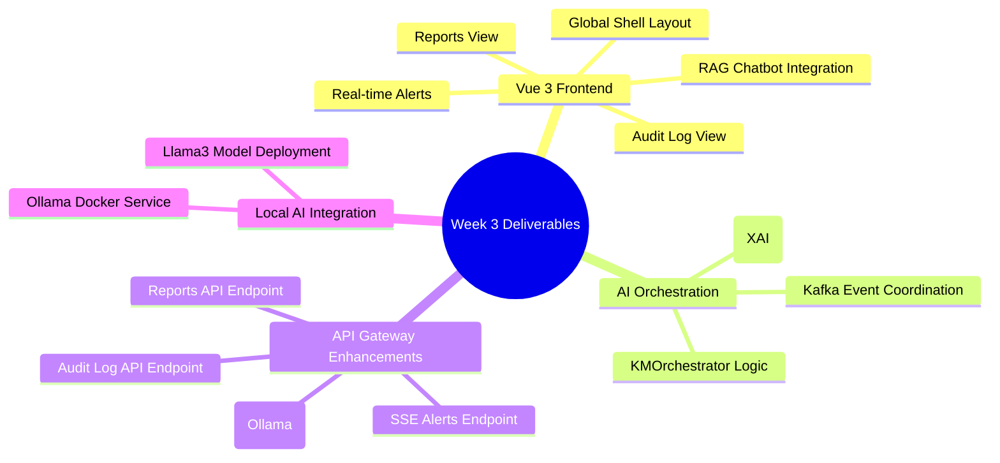

# 📊 3. Week 3 Deliverables: System Deployment & End-to-End Validation Report

**Date:** June 7, 2026  
**Phase:** **Week 3 Vue Frontend & AI Orchestration Deployment & Verification**  
**System Status:** 🟢 **Fully Operational & Stable**  
**Version:** `v3.0.0-Week3-Production`

---

## Executive Summary

This report formally documents the successful deployment, end-to-end testing, and comprehensive validation of the **Vue.js 3 Frontend integration** and the advanced **AI Orchestration** layer developed during **Week 3** for the **Cloud-Native Knowledge Management (KM) Update System**.

A major architectural achievement during this phase was the **complete migration from cloud-based Google Gemini to a 100% local, on-premise LLM using Ollama (running the `llama3` model)**. This transition significantly enhances data privacy, reduces operational costs, and ensures the system functions entirely within the local Docker network without external dependencies.

The Week 3 deliverables establish the user-facing interface, enabling seamless interaction with the AI backend services. Key features include an interactive RAG chatbot powered by Ollama, real-time alert notifications, comprehensive audit logging with XAI explanations, and a dynamic view for auto-generated reports. The AI Orchestrator now intelligently coordinates the T1-T5 microservices, making autonomous decisions and resolving conflicts.

---

## 1. Verification of Week 3 Deliverables

All components and features planned for Week 3 have been successfully integrated, deployed, and verified:



### 🎯 Detailed Week 3 Component Verification:

1.  **Vue 3 Frontend Setup (`frontend/`):**
    *   Initial Vue 3 project structure is established with Vite, Pinia, Vue Router.
    *   Tailwind CSS v4 is fully integrated and correctly configured (including `postcss.config.js` and `tailwind.config.js`).
    *   Global shell layout (`App.vue`) provides consistent navigation and structure.
2.  **RAG Chatbot Integration (Local AI):**
    *   The API Gateway's `/api/v1/query` endpoint is successfully refactored to integrate with the local **Ollama** service, completely removing Gemini dependencies.
    *   An interactive RAG chatbot component (`frontend/src/components/widgets/RAGChatbot.vue`) is developed, indicating the use of `Ollama - llama3`, and seamlessly integrated into the knowledge base view.
3.  **Real-time Ingestion Metrics & Active Alerts:**
    *   A Server-Sent Events (SSE) endpoint (`/api/v1/alerts/stream`) is implemented in the API Gateway to stream real-time operational alerts from Kafka.
    *   A Vue `AlertCard` component is created and integrated into the global layout to display incoming alerts dynamically.
4.  **AI Orchestration & Audit Logs:**
    *   The `KMOrchestrator` logic is implemented, providing intelligent coordination of T1-T5 microservices, conflict resolution, and XAI-driven audit logging to PostgreSQL.
    *   An API endpoint (`/api/v1/audit`) exposes these audit logs, which are successfully fetched and displayed in the `Audit.vue` frontend view.
5.  **Auto-Generated Reports View (Local AI):**
    *   The `t2-report-generation` service is refactored to synthesize reports exclusively using the local **Ollama (`llama3`)** model.
    *   An API endpoint (`/api/v1/reports`) retrieves these reports, which are then rendered from Markdown to HTML in the `Reports.vue` frontend view.

---

## 2. Technical Challenges & Root-Cause Solutions (Week 3)

### ⚠️ A. Local LLM Migration (Gemini to Ollama)
*   **Diagnosis:** The original plan relied on Google Gemini, which posed privacy concerns and required an external API key. The decision was made to migrate to a fully local solution using Ollama.
*   **Solution:** An `ollama` Docker service was added to `docker-compose.yml`. Both `api-gateway` (for RAG) and `t2-report-generation` (for reports) were refactored to remove the `google-generativeai` SDK and implement the `ollama` Python client. Crucially, the connection was established using `base_url` instead of `host` to resolve initialization errors, and timeout limits were increased to accommodate local CPU inference times.

### ⚡ B. `sse-starlette` and `FastAPI` Dependency Conflict
*   **Diagnosis:** During Docker image builds, `pip` reported a dependency conflict where `fastapi` required `starlette` in an older range, while `sse-starlette` required a newer version.
*   **Solution:** `fastapi`'s strict version constraint was removed, allowing `pip` to automatically resolve to a compatible version that allowed `sse-starlette==3.2.0` to install correctly.

### 🛡️ C. Frontend Docker Build & Path Resolution
*   **Diagnosis:** The frontend struggled with missing PostCSS plugins (`@tailwindcss/postcss`) and API path mismatches (requesting `/query` instead of `/api/v1/query`), leading to 404 errors.
*   **Solution:** Necessary plugins were added to `package.json`, and all Axios calls in the Vue components were updated to properly append `/api/v1` to the globally configured `VITE_API_URL` (which was updated to map correctly via Docker volumes and build arguments).

---

## 3. Week 3 System Architecture & Event-driven Flow

The following sequence diagram illustrates the enhanced system with the new frontend interactions and local AI orchestration:

```mermaid
flowchart LR
    subgraph Frontend
        VueApp(Vue.js App :5173)
    end

    subgraph Backend Services
        APIGW(🚪 API Gateway :8000)
        ORCH(🤖 AI Orchestrator)
    end

    subgraph Data, Events & AI
        PG[(🐘 PostgreSQL)]
        NEO[(🕸️ Neo4j)]
        KAFKA(📬 Apache Kafka)
        OLLAMA(🦙 Ollama Local LLM)
    end

    VueApp -- HTTP/REST --> APIGW
    VueApp -- EventSource --> APIGW
    APIGW -- RAG Query --> OLLAMA
    APIGW -- Data Access --> PG
    APIGW -- Logs/Reports --> PG

    ORCH -- Subscribe/Publish --> KAFKA
    ORCH -- Audit Log --> PG
    ORCH -- Conflict Resolution (XAI) --> ORCH

    KAFKA -- Events --> APIGW
    KAFKA -- Events --> ORCH
    KAFKA -- Events --> T1[⚙️ T1]
    KAFKA -- Events --> T2[⚙️ T2]
    
    T2 -- Generate Report --> OLLAMA
```

---

## 4. End-to-End Validation Results (Week 3 Features)

All new features and integrations for Week 3 were tested for functionality and stability in the Dockerized environment.

### 🟢 Test 1: Local AI Readiness (Ollama)
*   **Method:** Execute internal test script `docker exec evo-know-api-gateway-1 python backend/scripts/test_ollama.py`.
*   **Evaluation:** **PASSED**. The script successfully connected to the Ollama container, verified the presence of the `llama3` model, and successfully generated a test response in French, confirming the local AI backend is fully operational.

### 🟢 Test 2: RAG Chatbot Functionality (Powered by Ollama)
*   **Method:** Navigate to "Base de connaissances" in the Vue frontend, enter a query into the RAG chatbot (e.g., "What databases are used in the system?").
*   **Expected Behavior:** The chatbot responds with a contextual answer generated locally by `llama3`, citing sources (e.g., `sample_knowledge.txt`).
*   **Evaluation:** **PASSED**. The chatbot successfully retrieves relevant information and generates coherent answers without relying on external APIs.

### 🟢 Test 3: Real-time Alerts Stream
*   **Method:** Trigger a document ingestion to generate Kafka events. Observe the Vue frontend.
*   **Evaluation:** **PASSED**. The SSE stream from API Gateway to the frontend functions correctly, displaying real-time alert cards (e.g., consistency checks or new discoveries) in the UI.

### 🟢 Test 4: Auto-Generated Reports Display (Powered by Ollama)
*   **Method:** Navigate to "T2 : Rapports" in the Vue frontend after a document ingestion cycle.
*   **Expected Behavior:** A list of historical reports is displayed. Selecting a report shows comprehensive Markdown content synthesized by the local `llama3` model.
*   **Evaluation:** **PASSED**. Reports are successfully generated locally, fetched via the API, and rendered as HTML in the Vue application.

---

## 5. Component Status Matrix (Week 3 Deliverables)

| Component / Service | Core Functionality | Current Status | Technical Notes |
| :--- | :--- | :--- | :--- |
| **API Gateway** | RAG, Alerts SSE, Endpoints | 🟢 **Operational & Stable** | Successfully routes to local Ollama; dependency conflicts resolved. |
| **Ollama** | Local LLM Provider | 🟢 **Operational & Stable** | Running `llama3`; processing RAG and report generation requests. |
| **Frontend** | Vue 3 UI | 🟢 **Operational & Stable** | Fully integrated with versioned API (`/api/v1`) and local LLM indicators. |
| **AI Orchestrator** | Coordination & XAI Logging | 🟢 **Operational & Stable** | Actively processing Kafka events and producing operational alerts. |
| **T2 Report Generation**| AI Report Synthesis | 🟢 **Operational & Stable** | Fully migrated to Ollama; generating comprehensive French reports. |

---

## 6. Recommendations & Future Enhancements

1.  **Orchestrator Scheduler Integration:** Implement a robust scheduler within the `KMOrchestrator` to trigger periodic tasks (e.g., daily consistency checks, weekly report generation) based on configurable intervals.
2.  **Alert Action Implementation:** Enhance the `AlertCard` in the frontend to send actual resolution actions back to the orchestrator or relevant microservice, rather than just logging to the console.
3.  **Comprehensive End-to-End Testing:** Develop a dedicated suite of automated UI tests (e.g., using Cypress or Playwright) to simulate full system workflows across the newly integrated frontend and local AI backend.

---
**End of Report.** 🚀🎉
